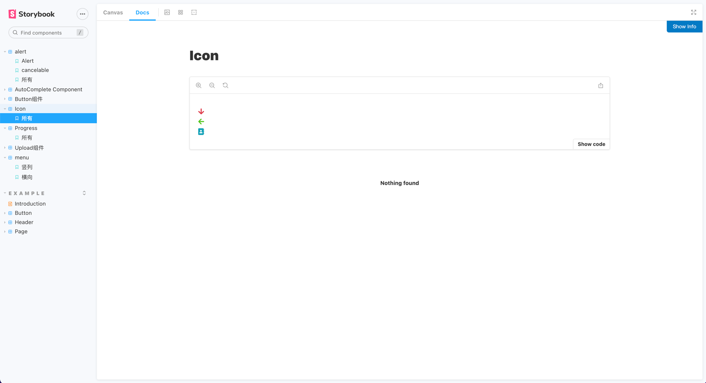

# Getting Started with Create React App

## 初始化项目
### `yarn add`

## 预览组件

### `storybook start`


## 运行测试用例 testing-library

### `yarn test`

```
 PASS  src/components/Button/button.test.tsx
 PASS  src/components/Menu/menu.test.tsx

Test Suites: 2 passed, 2 total
Tests:       7 passed, 7 total
Snapshots:   0 total
Time:        3.594 s
Ran all test suites.

Watch Usage: Press w to show more.
```





